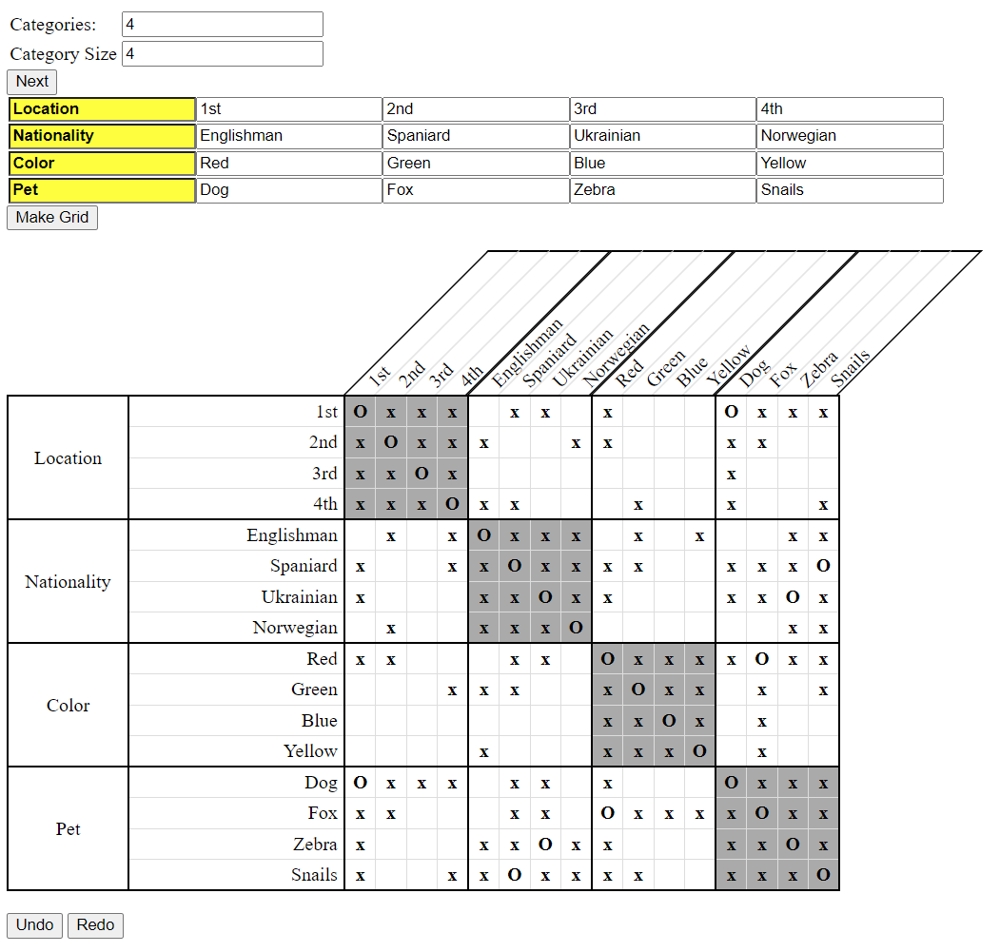

# LogikGrid

LogikGrid is a simple jquery-based webpage for creating an interactive grid to aid in solving Zebra-style logic puzzles.

The figure below illustrates how to use it. You simply select the desired number of categories and the category size of your puzzle, type in what will become the rows and columns of your grid, then click the individual cells to add your X's and O's.

*LogikGrid* offers several useful features including undo/redo buttons, row & column highlighting, automatic reflection, and automatic crossout. 

---

**Figure 1: Screenshot of LogikGrid**

